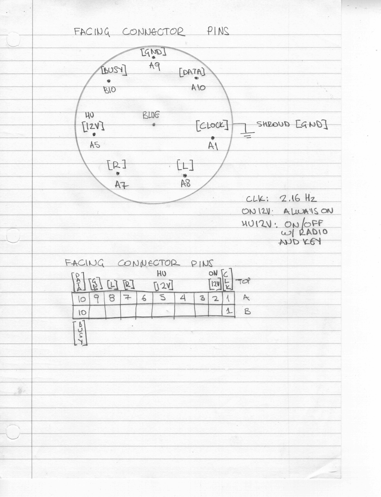
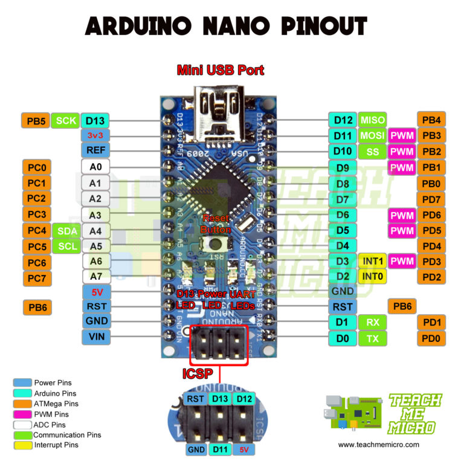

# TA Trikalinos notes 

From:  http://gizmosnack.blogspot.com/2015/11/aux-in-volvo-hu-xxxx-radio.html

1. The source knob on the HU lacks the ability to choose the CD-CHGR until you connect the CD-changer. 
2. To trick the HU that you have a connected a CD-CHGR is not as easy as to shorten two of the pins on the DIN-connector, but it has to be done in code via a protocol named MELBUS
3. MELBUS is a protocol that utilizes a clock pin and a single bi directional data line to transfer the data between the units and the HU.
4. MELBUS uses three lines: Clock, Data and Busy see blue lines on picture below: ("Run" is just 12V from battery)



5. In the picture above you can also see the Left and Right Audio signals that I tapped into for the AUX-input (Red). 
6. Focus on the left DIN-Socket (female) on the picture, that's the back female socket on the HU. 


## Pinout for the Arduino Nano

In the current configuration file for the Arduino Nano (and clones)
use the following: 
```
 *  DATA: Digital Pin 3 = PD3 (PCINT19/OC2B/INT1) 
 *   CLK: Digital Pin 2 = PD2 (PCINT18/INT0)     
 *  BUSY: Digital Pin 4 = PD4 (PCINT20/XCK/T0)   
 *  LED_RR: Digital Pin 5 
 *  LED_TX: Digital Pin 6 
```




# MELBUS Acknowledgement (Original README)


Special thanks to Reinis work on the protocol: http://volvo.wot.lv/wiki/doku.php?id=melbus
He also has a more sophisticated carpc project at https://github.com/festlv/carpc
But his implementation for the AVR does "too much", I just want to plugin a 3.5mm connector (from Bluetooth adapter) as pseudo CD-Changer, for now (and learn some stuff about embedded programming).

I should also mention Karl at http://gizmosnack.blogspot.de/2015/11/aux-in-volvo-hu-xxxx-radio.html has a nice write up plus (more simple!) code for the Arduino Nano there.
